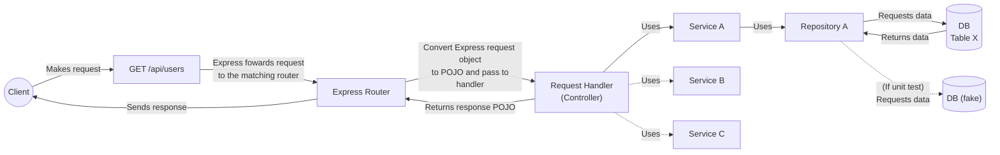

[](https://mermaid.live/edit#pako:eNqNU9tO5DAM_RUrT63EDO8DQqKd4bJixWqGlZAahDKth-nSJt0kZRch_h0nvUzDA-Kprn18bB87byxXBbIFe9Ki2cPN-oRLgLQqUdoo6r5x7Hxr_Nuisdnl6g6ORVMetwa1efAh1VrU2ep_o9GY_tdHUiWtVlVFUc56BrgSsiDP6VafRQdAzJlP2aB-KXN8PM96C84DfzL6k8Cfjv60awobZUqr9CtRHX56tmXyuEZRZdEycX3ciW2FcB8PsQvxjFnE2TKBaEc2NediB21gNoOfFDCg-6lms7NBo4lcDjfoslP_hC7GDFfXKrB7hFrYfF_KJ9Beuo7Lmwd5HdMGpc83jZIGPaxrJ4SRqC-o7Vh4aFFt_2Du6wIV_nX74xZoFdAIwpBj3-2lox33Eq7R0a_RtlpO-vBMYc9hxm9DQjnAuNzPmHmHmU8wyTcwaXAxQanp_j_fQzeFF8VAIazwGf1NTM5jOu0I-5p4DpxF1ztoZWnBUoHY6R0U48zP0J8ZO2I16lqUBb3CN0fIGd1EjZwtyCyEfuaMy3fCtQ2l46pwxdhiJyqDR0y0Vm1eZc4WVrc4gJaloBdd96j3DyWoUjw)

